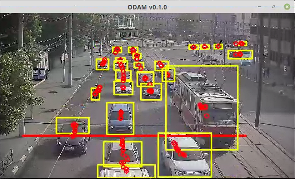
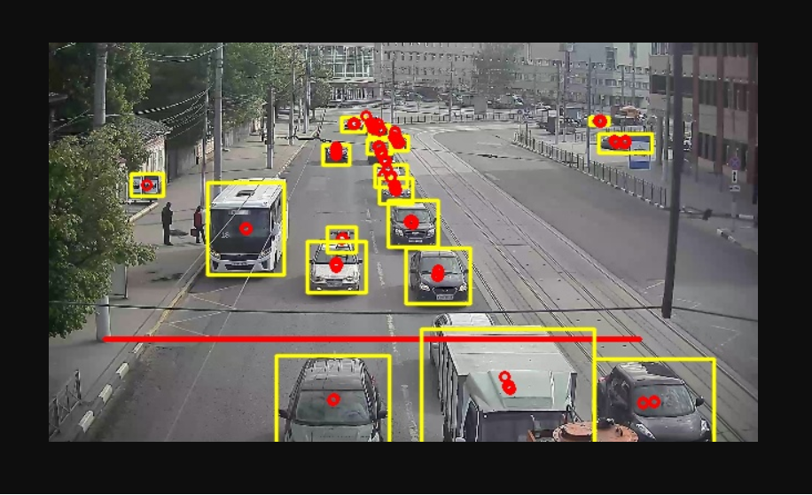

# ODaM - Object Detection and Monitoring
[](https://godoc.org/github.com/LdDl/odam) [](https://sourcegraph.com/github.com/LdDl/odam?badge) [](https://goreportcard.com/report/github.com/LdDl/odam) [](https://github.com/LdDl/odam/releases)
# v0.6.5
ODaM is project aimed to do monitoring such as: pedestrian detection and counting, vehicle detection and counting, speed estimation of objects, sending detected objects to gRPC server for detailed analysis.

It's written on Go with a lot of [CGO](https://golang.org/cmd/cgo/).

## Work in progress
Notice that gRPC integration uses 'license_plate_recognition' protobuff (see gRPC server here https://github.com/LdDl/license_plate_recognition)

## Table of Contents
- [About](#about)
- [Installation](#installation)
- [Usage](#usage)
- [Screenshots](#screenshots)
- [Support](#support)
- [Roadmap](#roadmap)
- [Dependencies](#dependencies)
- [License](#license)
- [Devs](#developers)

## About
ODaM is tool for doing monitoring via Darknet's neural network called Yolo V4 (paper: https://arxiv.org/abs/2004.10934).

It's built on top of [go-darknet](https://github.com/LdDl/go-darknet#go-darknet-go-bindings-for-darknet-yolo-v4-yolo-v3) which uses [AlexeyAB's fork of Darknet](https://github.com/AlexeyAB/darknet/#yolo-v4-and-yolo-v3v2-for-windows-and-linux). For doing computer vision stuff and video reading [GoCV](https://github.com/hybridgroup/gocv#gocv) is used.

## Installation
### notice: targeted for Linux users (no Windows/OSX instructions currenlty)
**Need to enable CUDA (GPU) in every installation step where it's possible.**

1. Install CUDA (we recommend version 10.2)
    ```bash
    wget https://developer.download.nvidia.com/compute/cuda/repos/ubuntu1804/x86_64/cuda-ubuntu1804.pin
    sudo mv cuda-ubuntu1804.pin /etc/apt/preferences.d/cuda-repository-pin-600
    wget http://developer.download.nvidia.com/compute/cuda/10.2/Prod/local_installers/cuda-repo-ubuntu1804-10-2-local-10.2.89-440.33.01_1.0-1_amd64.deb
    sudo dpkg -i cuda-repo-ubuntu1804-10-2-local-10.2.89-440.33.01_1.0-1_amd64.deb
    sudo apt-key add /var/cuda-repo-10-2-local-10.2.89-440.33.01/7fa2af80.pub
    sudo apt-get update
    sudo apt-get -y install cuda
    echo 'export PATH=/usr/local/cuda/bin:$PATH' >> ~/.bashrc
    echo 'export LD_LIBRARY_PATH=/usr/local/cuda/lib64:LD_LIBRARY_PATH'  >> ~/.bashrc
    source ~/.bashrc
    ```
2. Install cuDNN (we recommend version v7.6.5 (November 18th, 2019), for CUDA 10.2)
    Go to [NVIDIA's site](https://developer.nvidia.com/rdp/cudnn-download) and download *.deb package. After downloading *.deb package install it:
    ```bash
    sudo dpkg -i libcudnn7_7.6.5.32-1+cuda10.2_amd64.deb
    sudo dpkg -i libcudnn7-dev_7.6.5.32-1+cuda10.2_amd64.deb
    sudo dpkg -i libcudnn7-doc_7.6.5.32-1+cuda10.2_amd64.deb
    ```
    Do not forget to check if cuDNN installed properly:
    ```bash
    cp -r /usr/src/cudnn_samples_v7/ $HOME
    cd  $HOME/cudnn_samples_v7/mnistCUDNN
    make clean && make
    ./mnistCUDNN
    cd -
    ```
3. Install [AlexeyAb's fork of Darknet](https://github.com/AlexeyAB/darknet)
    ```bash
    git clone https://github.com/AlexeyAB/darknet
    cd ./darknet
    # Checkout to last battle-tested commit
    git checkout f056fc3b6a11528fa0522a468eca1e909b7004b7
    # Enable GPU acceleration
    sed 's/GPU=0/GPU=1/' ./Makefile
    # Enable cuDNN
    sed 's/CUDNN=0/CUDNN=1/' ./Makefile
    # Prepare *.so
    sed 's/LIBSO=0/LIBSO=1/' ./Makefile
    make
    # Copy *.so to /usr/lib + /usr/include (or /usr/local/lib + /usr/local/include)
    sudo cp libdarknet.so /usr/lib/libdarknet.so && sudo cp include/darknet.h /usr/include/darknet.h
    # sudo cp libdarknet.so /usr/local/lib/libdarknet.so && sudo cp include/darknet.h /usr/local/include/darknet.h
    ```
    Alternatively you can use Makefile from go-darknet repository: https://github.com/LdDl/go-darknet/blob/master/Makefile
    
4. Go bindings for Darknet - [instructions link](https://github.com/LdDl/go-darknet#installation)
5. GoCV - [instructions link](https://github.com/hybridgroup/gocv#how-to-install).
6. Blob tracking library - [instructions link](https://github.com/LdDl/gocv-blob#installation)
7. If you want to use gRPC client-server model: gRPC - [instructions link](https://github.com/grpc/grpc-go#installation)

   You need to implement your gRPC server as following proto-file: https://github.com/LdDl/odam/blob/master/yolo_grpc.proto.

   If you need to rebuild *.pb.go file, call this is from project root folder:
   ```
   protoc -I . yolo_grpc.proto --go_out=plugins=grpc:.
   ```
   In case of my needs I need to detect license plates on vehicles and do OCR on server-side: you can take a look on https://github.com/LdDl/license_plate_recognition for gRPC server example

After steps above done:
```
go get github.com/LdDl/odam
go install github.com/LdDl/odam
```
Check if executable available
```
odam -h
```
and you will see something like this:
```
Usage of ./odam:
-settings string
        Path to application's settings (default "conf.json")
```

## Usage
### notice: targeted for Linux users (no Windows/OSX instructions currenlty)

* Prepare neural network stuff
    * Download YOLO's weights, configuration file and *.names file. Your way may warry, but here is our script: [download_data.sh](cmd/odam/download_data.sh)
        ```
        ./download_data_v3.sh
        ```
    * Make sure there is link to *.names file in YOLO's configuration file:
        ```
        [yolo]
        mask = 0,1,2
        anchors = 10,13,  16,30,  33,23,  30,61,  62,45,  59,119,  116,90,  156,198,  373,326
        classes=80
        num=9
        jitter=.3
        ignore_thresh = .7
        truth_thresh = 1
        random=1
        names = coco.names # <<========= here is the link to 'coco.names' file
        ```
* Prepare configuration file for application. Example of file: [conf.json](cmd/odam/conf.json). Description of fields:
```Makefile
{
    "video_settings": { # Video input settings
        "source": "rtsp://127.0.0.1:554/h264", # Link to RTSP stream
        "width": 1920, # Width of image in video source
        "height": 1080, # Height of image in video source
        "reduced_width": 640, # Desired width of image (for imshow and MJPEG streaming, also reduces inference time (processing > accuracy) for neural network)
        "reduced_height": 360, # Desired height of image (for imshow and MJPEG streaming, also reduces inference time (processing > accuracy) for neural network)
        "camera_id": "f2abe45e-aad8-40a2-a3b7-0c610c0f3dda" # Unique ID for video source (useful for 'client-server' model)
    },
    "neural_network_settings": { # YOLO neural network settings
        "darknet_cfg": "yolov3.cfg", # Path to configuration.file
        "darknet_weights": "yolov3.weights", # Path to weights wile
        "darknet_classes": "coco.names", # Path to *.names file (labels of objects)
        "conf_threshold": 0.2, # Confidence threshold
        "nms_threshold": 0.4, # NMS threshold (postprocessing)
        "target_classes": ["car", "motorbike", "bus", "train", "truck"] # What classes you want to detect (if you want to use public dataset, but ignore some classes)
    },
    "cuda_settings":{ # CUDA settings, currently useless
        "enable": true # CUDA settings, currently useless
    },
    "mjpeg_settings":{ # MJPEG streaming settings
        "imshow_enable": false, # Do you want to enable imshow() feature (useful for testing purposes)
        "enable": true, # Do you want to enable this feature?
        "port": 35678 # Listening port fo connections
    },
    "grpc_settings": { # gRPC 'client-server' model settings
        "enable": true, # Do you want to enable this feature?
        "server_ip": "localhost", # gRPC server's IP
        "server_port": 50051 # gRPC server's listening port
    },
    "tracker_settings": { # Tracked settings
        "lines_settings":[
            {
                "line_id": 1, # Unique ID for line id (useful for 'client-server' model)
                "begin": [150, 800], # [X1,Y1], start point of line (usually, left side)
                "end": [1600, 800], # [X2,Y2], end point of line (usually, right side)
                "direction": "to_detector", # Direction of line (possible values: 'to_detector' and 'from_detector')
                "detect_classes": ["car", "motorbike", "bus", "train", "truck"], # What classes must be cropped (as detected objects) that were captured by detection line.
                "rgba": [255, 0, 0, 0], # Color of detection line
                "crop_mode": "crop" # When 'grpc_settings' field 'enable' is set to TRUE this option will be used for sending either cropped detected object (bbox==crop) or full image with bbox info to gRPC server-side application. Default is 'crop'
            }
        ],
        "draw_track_settings": { # Tracker drawing settings (for WOW effect in imshow() or MJPEG streaming)
            "max_points_in_track": 150, # Restriction for maximum points in single track (>=1). Default value 10 (in case of value less than 1)
            "bbox_settings": { # Setting for bounding boxes (detected objects)
                "rgba": [255, 255, 0, 0], # Color of bounding box border
                "thickness": 2 # Thickness as is
            },
            "centroid_settings": { Setting for centroid of bounding boxes
                "rgba": [255, 0, 0, 0], # Color of circle
                "radius": 4, # Radius of circle
                "thickness": 2 # Thickness as is
            },
            "text_settings": { Setting for text above bounding boxes
                "rgba": [0, 255, 0, 0], # Text color
                "scale": 1.2, # Size of text
                "thickness": 2, # Thickness as is
                "font": "hershey_plain"
            },
            "display_object_id": true # If you want to display object identifier
        }
    },
    "matpprof_settings": { # pprof for GoCV. Useful for debugging
        "enable": true # Do you want to enable this feature?
    }
}
```

* Run
    ```
    odam --settings=conf.json
    ```

## Screenshots
* gocv.Imshow() output:

    

* MJPEG streaming output:

    

## Support
If you have troubles or questions please [open an issue](https://github.com/LdDl/odam/issues/new).
Feel free to make PR's (we do not have contributing guidelines currently, but we will someday)

## Roadmap
Please see [ROADMAP.md](ROADMAP.md)

## Dependencies
* Bindings to [OpenCV](https://github.com/opencv/opencv) - [GoCV](https://github.com/hybridgroup/gocv#gocv). License is Apache-2.0
* MJPEG streaming via GoCV - [mjpeg](https://github.com/hybridgroup/mjpeg). No license currently
* Darknet (AlexeyAB's fork) - [darknet](https://github.com/AlexeyAB/darknet#yolo-v4-and-yolo-v3v2-for-windows-and-linux). License is YOLO LICENSE
* Golang binding to darknet - [go-darknet](https://github.com/LdDl/go-darknet#go-darknet-go-bindings-for-darknet-yolo-v4-yolo-v3). License is Apache-2.0
* Tracking objects - [gocv-blob](https://github.com/LdDl/gocv-blob#gocv-blob). No license currently
* gRPC for doing "'client-server'" application - [grpc](https://github.com/grpc/grpc-go). License is Apache-2.0

## License
You can check it [here](LICENSE.md)

## Developers

cpllbstr https://github.com/cpllbstr

LdDl https://github.com/LdDl

Pavel7824 https://github.com/Pavel7824
